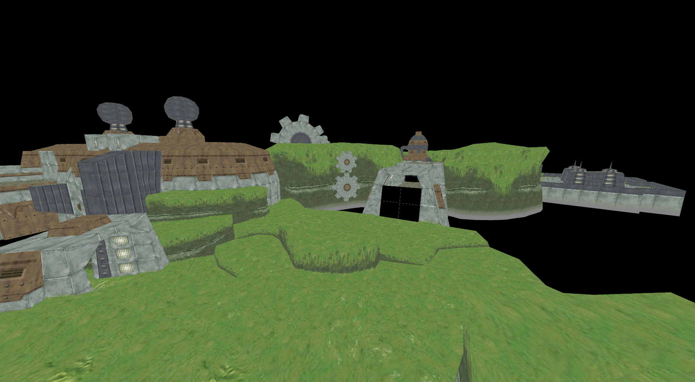
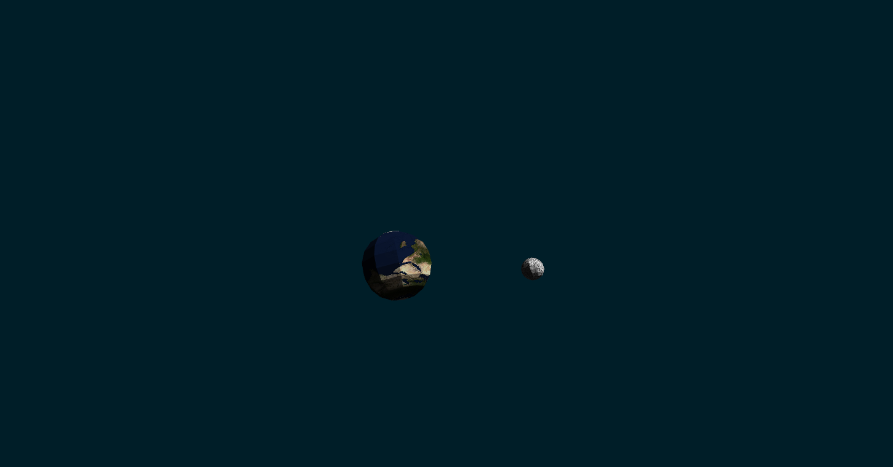
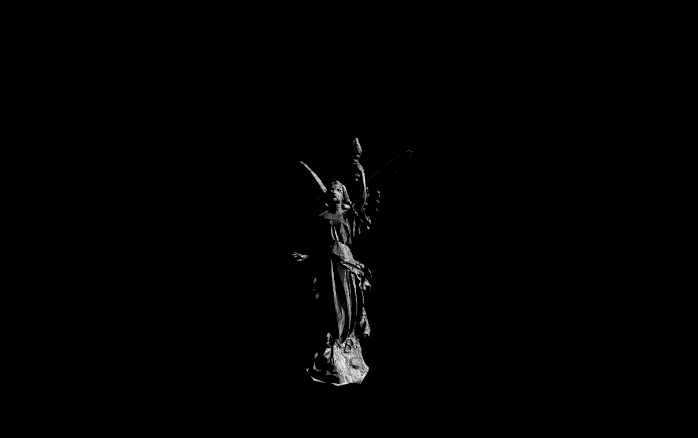

<h3>amateur WIP 3d engine</h3>

features

<ul>
<li>simple rasterization of 3d objects
</li>
<li>basic camera view
</li>
<li>textures
</li>
<li>simple surface normal lighting
</li>
<li>adding multiple meshes
</li>
<li>sphere collider
</li>
<li>time delta
</li>
</ul>

todo

<ul>
<li>aabb collider
</li>
<li>materials with properties
</li>
<li>better lighting
</li>
<li>child-parent model of applying transformations
</li>
</ul>

